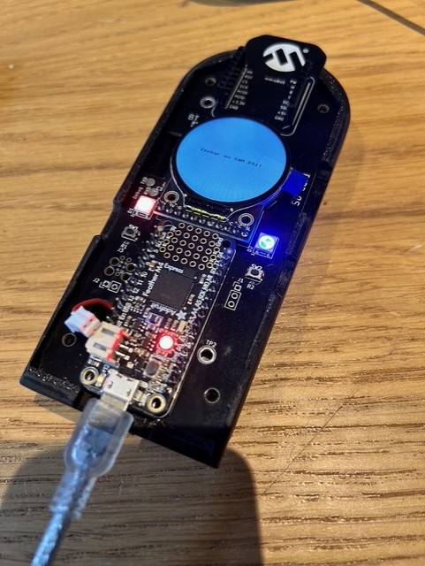

# SAM-IOT-ML Zephyr Project



Zephyr RTOS applications for the Feather M4 (ATSAMD51) and SAM E54 Xplained Pro
evaluation boards. Includes a 6-DOF IMU, heart rate monitor, range sensor, and
weather station — each with an LVGL graphical display and serial data output.

## Prerequisites

- [Zephyr SDK](https://docs.zephyrproject.org/latest/develop/toolchains/zephyr_sdk.html) (ARM toolchain)
- Python 3.10+ with `west` installed: `pip install west`
- CMake 3.20+

## Getting Started (Fresh Clone)

```bash
# Clone this repository
git clone <repo-url> sam-iot-ml

# Initialize west workspace (pulls only required Zephyr modules)
west init -l sam-iot-ml
west update

# Activate your Zephyr SDK environment, then build:
cd sam-iot-ml
west build -p always -b feather_m4_zephyr_ot mchp_6dof_imu -d build_mchp_6dof_imu
```

The custom `west.yml` manifest imports only the modules needed by these
applications (hal_atmel, cmsis, lvgl, fatfs, picolibc) rather than the full
Zephyr module set.

## Build Commands

### feather_m4_zephyr_ot

```bash
west build -p always -b feather_m4_zephyr_ot mchp_6dof_imu -d build_mchp_6dof_imu
west build -p always -b feather_m4_zephyr_ot mchp_hrm_gfx -d build_mchp_hrm_gfx
west build -p always -b feather_m4_zephyr_ot mchp_hw_test -d build_mchp_hw_test
west build -p always -b feather_m4_zephyr_ot mchp_range_gfx -d build_mchp_range_gfx
west build -p always -b feather_m4_zephyr_ot mchp_weather_gfx -d build_mchp_weather_gfx
```

### same54_xpro

```bash
west build -p always -b same54_xpro mchp_6dof_imu -d build_mchp_6dof_imu
west build -p always -b same54_xpro mchp_hrm_gfx -d build_mchp_hrm_gfx
west build -p always -b same54_xpro mchp_hw_test -d build_mchp_hw_test
west build -p always -b same54_xpro mchp_range_gfx -d build_mchp_range_gfx
west build -p always -b same54_xpro mchp_weather_gfx -d build_mchp_weather_gfx
```

## Flash Commands

### feather_m4_zephyr_ot

Uses the bossac runner. Adjust `--bossac-port` to match your COM port. To enter
bootloader mode on the feather board you must press the reset button quickly
twice.

```bash
west flash -r bossac --bossac-port="COM29" -d build_mchp_6dof_imu
west flash -r bossac --bossac-port="COM29" -d build_mchp_hrm_gfx
west flash -r bossac --bossac-port="COM29" -d build_mchp_hw_test
west flash -r bossac --bossac-port="COM29" -d build_mchp_range_gfx
west flash -r bossac --bossac-port="COM29" -d build_mchp_weather_gfx
```

### same54_xpro

```bash
west flash -d build_mchp_6dof_imu
west flash -d build_mchp_hrm_gfx
west flash -d build_mchp_hw_test
west flash -d build_mchp_range_gfx
west flash -d build_mchp_weather_gfx
```

## Python GUI

A tkinter + matplotlib application that displays live sensor data from up to 4
connected devices simultaneously.

```bash
cd mchp_gui
pip install -r requirements.txt
python mchp_gui.py
```

Each device sends measurements over USB CDC using an NMEA-style `$MCHP` serial
protocol. The GUI auto-detects the application type (IMU, HRM, Range, Weather)
and displays the appropriate view.

## Project Structure

```
sam-iot-ml/
├── west.yml                    # West manifest (minimal module set)
├── boards/arm/feather_m4_zephyr_ot/  # Custom board definition
├── mchp_common/modules/        # Shared Zephyr extra modules
│   ├── board_root/             # Board discovery for west builds
│   ├── mchp_serial/           # $MCHP serial protocol output
│   └── ws2812_common/         # WS2812 RGB LED driver
├── mchp_6dof_imu/            # 6-axis IMU application (ICM42688)
├── mchp_hrm_gfx/             # Heart rate monitor (AFE4404)
├── mchp_range_gfx/           # Range sensor (VL6180X)
├── mchp_weather_gfx/         # Weather station (BME280)
├── mchp_hw_test/             # Hardware test application
└── mchp_gui/                  # Python live data viewer
```
